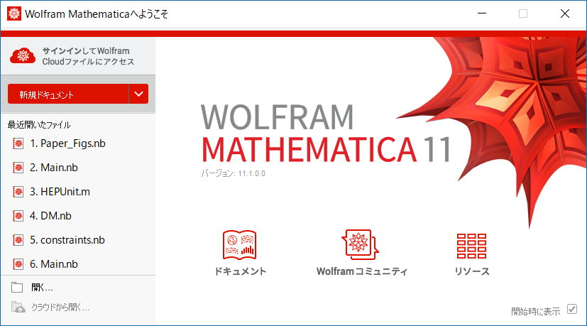
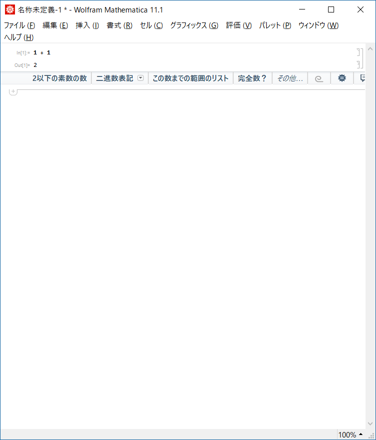
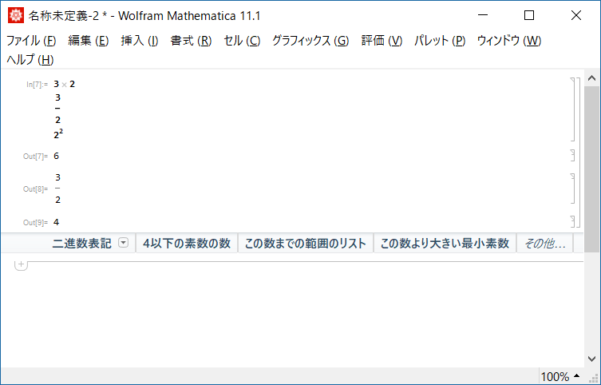

# はじめに
このドキュメントは、私hfukudaが得たMathematicaに関する知見をまとめたノートです。[github上](https://github.com/hajifkd/progmath)で管理されていますので、もし誤り等があったらPRを送ってください。

前提知識としては何らかのプログラミング言語を触ったことがあり、関数や変数などの概念を理解していることを仮定します。著者の知識上HaskellやRustなどの関数型プログラミング言語から概念を借用することがあるかもしれません。そのため、それらの言語を多少知っていると、わかりやすい箇所がある可能性があります。

また、これを書いておきながらですが私は別にMathematicaが好きなわけではありません。このドキュメントでは、上記のプログラミング言語における経験を踏まえ、なるべく**私に**ストレスがない書き方を徹底していくので、Wolfram的な書き方ではないかもしれません。

このドキュメント上のコード断片は、断りがない限りそれぞれ独立なものだと思ってください。Mathematicaは基本的に参照透明な言語ではないので、それまでに実行されたコードのせいで以後のコードの実行結果が異なることがありえます。更に嫌なのは、破壊的代入を行っても警告などは一切でないので、自分で変数のスコープに気を配る必要があります。個人的にこれはMathematicaの💩なところWorst 3くらいに入る仕様ですが、仕方ありません。ということで、なにか不審な動作に遭遇したら、コード断片を実行する前に
```Mathematica
Quit[];
```
をしておくとインタプリタを一旦終了してまっさらな状態から始めることができますので、試してみてください。あるいは、ctrl+Nで新しいノートブックを開き、(評価) -> (ノートブック用デフォルトコンテクスト)から(このノートブックに固有)を選択してそのノートプックでコードを実行することによっても、既存のインタプリタを保ったまま大抵の問題は避けることができると思います。

最後にですが、本ドキュメントを通して、Mathematicaのライブラリの解説は基本的に一切しません。「やりたいこと Mathematica」でググればたいてい一発で出ますので、必要に応じて調べてください。

# How to use Mathematica
まず、Mathematicaを初めて起動すると戸惑うのは、どうやってMathematicaを使うか、ということだと思います。そこから始めていきましょう。

## 電卓としてのMathematica
まずは、四則演算を行い、Mathematicaを高級な電卓として使ってみます。
Mathematicaを起動すると、次の画面が出るかと思います。



ここの「新規ドキュメント」をクリックし、ノートブックを開きましょう。そうしたらノートブックの適当なところをクリックし、
```Mathematica
1 + 1
```
と入力し、Shiftを押しながらEnterを押してください。下図のように、きちんと2が表示されたでしょうか？



基本的には、これがMathematicaの「使い方」の全てです。一行に複数入力する場合、それぞれEnterで改行して入力し、最後にShift+Enterで実行してみてください。なお、以下の例の意味はそれぞれ引き算、掛け算、割り算、累乗です。
```Mathematica
1 - 2
3 * 2
3 / 2
2 ^ 2 
```
…できたでしょうか？なお、ひとかたまりの入力のことを、Mathematicaではセルというふうに呼びます。何もないところをクリックすると新しいセルを作れますし、すでにあるセルを編集することもできます。いずれにせよ実行する場合はShift+Enterを押します。セルには特にプログラム的な意味はないですが、同じ処理を同じセルで行うと見栄えがよく、ノートブックを見た人に意味が伝わりやすいです。

## 見栄えのよい入力方法
上で掛け算、割り算、累乗を入力してみましたが、実はそれぞれもう少し「きれいな」入力方法があります。まず、掛け算に関しては*を押さなくても空白で代用することができます。割り算と累乗については、/, ^を押すときに、一緒にctrlキーも押してみてください。Macではおそらくcommandキーだと思います。どちらとも、文字が小さくなりますので、どこまで分母か、どこまで指数かに気をつけて入力してください。矢印キー➡を押すことで、分母・分子・分数外などを適当に移動することができます。下図のような「きれいな」式が得られましたか？



これらのきれいな入力は、見栄えを良くするのに便利です。本ドキュメントでも、掛け算の*はしばしば省略します。割り算・累乗は残念ながら本ドキュメントで実装するのは面倒なので行いませんが、みなさんは活用してみてください。

## コメント
見栄えということで関連してコメント機能も紹介します。
`(**)`で囲まれた領域がコメントとなり、評価されません。
```Mathematica
1 + 1 (*1と1を足したら2*)
```
一行コメントが無いのは極めてフラストレーティングですが、仕方ありません。うまく使っていきましょう。

## 真偽値

## 変数とシンボル
続いては、変数の使い方です。結局のところ後述するように、Mathematicaには変数という概念はなく、ただ置換のルールがあるのみであるのですが、ここではとにかく変数だと思ってください。

変数代入は、単に代入するだけです。
```Mathematica
x = 1
x + 1
```
`1`と`2`が表示されたかと思います。最初の`1`は何なんだ？と思われるかもしれませんが、C言語などと同様、Mathematicaでは変数代入も値をもった式として扱われます。そのため、`x = 1`という式を評価して、`1`が表示されたわけです。これが鬱陶しければ、
```Mathematica
x = 1;
x + 1
```
のように、文末にセミコロン`;`をつけてください。セミコロンで終わる式は値を返しません。

なお、ここで紹介した代入方法は、正格評価 (eager evaluation) と呼ばれる方法であり、代入を行った瞬間に右辺が評価されるものです（正確には、置換のルールを定めた瞬間に置換対象が評価される）。正格評価と対になる概念として、遅延評価 (lazy evaluation) があります。遅延評価による代入は、コロンを用いて次のように行われます。
```Mathematica
z := 1
```
遅延評価による代入を行った場合、そもそも右辺が評価されないので、セミコロンを書かずとも式は値を持ちません。正格評価と遅延評価の違いは後述しますが、とりあえず基本的には正格評価を使っていけばよいでしょう。

さて、では変数宣言をしない状態では、`x`や`y`といった文字はどのような意味を持つのでしょうか？
```Mathematica
y
```
と実行すると、単に`y`と表示されたかと思います。Mathematicaでは特に宣言していない変数は、ただのシンボルとして扱われます。シンボルに対しても後から値を割り当てることができます。
```Mathematica
x = y + 1
y = 2;
x
```
値を割り当てると、その後値を変えることができないので、後述の`ReplaceAll`を使うことが多いでしょう。

## 関数呼び出し (@, //, ~hoge~)

# 関数宣言

## 正格評価と遅延評価

## 宣言方法

# ベクトル・行列 (List)

## 要素の取り出し

## 関数適用

## ドット積

# 置換とマッチング

## ReplaceAll

## パターンマッチング

* Head

## マッチング中のガード (guard)

## 置換ルールとしての関数宣言

* Sequence

# 関数型言語として使うMathematica
* カリー化なんてありません

## 再帰

* マッチングをうまく使う
* 階乗
* クイックソート

```Mathematica
qsort[{x_, y___}] := qsort[Select[{y}, # <= x &]] ~Join~ {x} ~Join~ qsort[Select[{y}, # > x &]]
qsort[{}] := {}
```

## 関数オブジェクト

## ラムダ式(無名関数)

## 関数合成 (@*)

## 便利な関数たち

### Map (@/)

### Select (filter)

### Fold (foldl)

# 制御構造

## If
* 自分で実装できる

## Table (For)
* ReplaceAllで済ませることもできるが有用

### ParallelTable
* Interpolationと組み合わせて簡単に馬鹿パラできる

# スコープの限定

## ReplaceRepeated (//.)
* where的で気持ち良い書き方

## Block (With)
* 違いは再帰的に適用されるか
* Blockのほうがパフォーマンスがよいので推奨されるか

# 型

```Mathematica
f[a_] := Block[
  {
    x = If[a < 1, {1, 2}, {3, 4}]
  }, 
  x[[1]]
];
NIntegrate[f[x], {x, 0, 2}] (* 動かない *)
```

```Mathematica
f[a_?NumericQ] := Block[
  {
    x = If[a < 1, {1, 2}, {3, 4}]
  }, 
  x[[1]]
];
NIntegrate[f[x], {x, 0, 2}] (* 4 *)
```

# データ構造
* 例: PolarVector

## 代数的データ型

* 空の関数適用によりデータ構造を表す
* パターンマッチングで中身を取り出す

## 「型クラス」

* 既存の関数に対して新しい振る舞いを定義する
